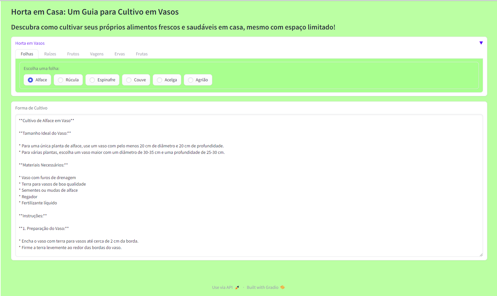

# **Projeto** - Horta Sustentavel Residêncial

A ideia do projeto ***Horta Sustentavel Residêncial*** nasceu na **Imersão IA (2ª Edição)** promovida pela [**Alura**](https://www.alura.com.br/) com parceria do [**Google**](https://www.google.com.br/), para demonstrar o uso da [***API Google Gemini***](https://gemini.google.com/app) que é uma IA **Multi Modal**, dando insights de como utilizar a IA para resolver problemas e melhorar os desempenhos e a produtividade.

## **Problema** - Produzir alimento em residência

### Esta aplicação vem ajudar as pessoas a produzirem alimentos de forma sustentável, dando dicas de como cultivar vegetais, ervas e frutas em pequenos espaços com a ajuda de vasos.

## Execução
**Importante :**  
Substituir no código a **SECRET_API_GEMINI** pela sua chave, infelizmente o GitHub não consegue executar o projeto automáticamente, devido a instalação de SDKs especificos do Gemini e gradio .
```
//Código dentro do arquivo horta_sustentavel_residencial.ipynb
GOOGLE_API_KEY= userdata.get('SECRET_API_GEMINI')
```

Você pode fazer o clone do projeto e abrir o arquivo ( *horta_sustentavel_residencial.ipynb* ) no [Google Colab](https://colab.research.google.com/) e executar.
```
git clone https://github.com/ffsf-filho/horta_sustentavel_residencial.git
```

## Interface:


## Linguagem utilizada:
- [PYTHON](https://www.python.org/)

## Bibliotecas
- [google-generativeai](https://cloud.google.com/vertex-ai/generative-ai/docs/learn/overview)
- [gradio](https://www.gradio.app/docs)

## Ambiente
- [Google Colab](https://colab.research.google.com/)

### Autor
---
<table>
  <tr>
      <td>
        <a href="https://github.com/ffsf-filho">
          
          <br />
          <sub>
            <b>Francisco F S Filho</b>
          </sub>
        </a>
      </td>
  </tr>
</table>
